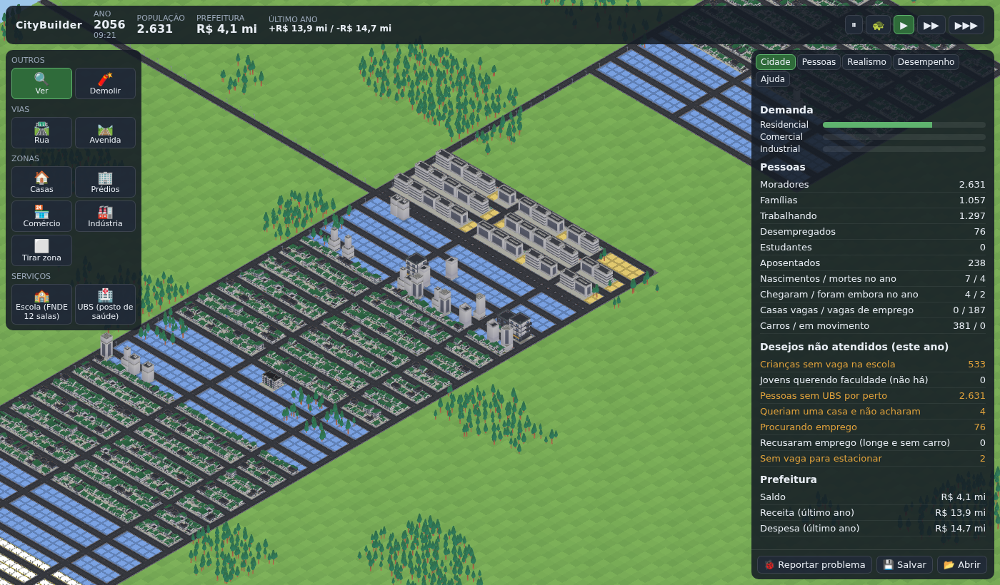

# CityBuilder

City builder isométrico no navegador, inspirado no Cities: Skylines. Cada morador tem uma vida própria: nasce, estuda, trabalha, casa (ou não), tem filhos (ou não), compra carro, envelhece e morre. As regras e os números vêm de dados reais do Brasil (IBGE, leis, pesquisas), e cada valor traz a fonte ao lado.



## O que tem de diferente

- **Nada surge do nada.** Toda pessoa nasce na cidade ou chega pela estrada. Todo carro tem dono e fica estacionado em algum lugar. Toda viagem tem motivo. Há uma lista de todos os moradores, com a história de cada um.
- **Realista e medido.** O jogo compara a cidade com a vida real (expectativa de vida, mortalidade infantil, filhos por mulher, desemprego...) num placar de realismo.
- **Leve.** Uma cidade de 50 mil pessoas gasta menos de 1 segundo por dia do jogo. Na velocidade 1x um dia dura 2 minutos, então sobra muita folga. A simulação roda separada da tela, então a tela não trava.
- **Reproduzível.** Mesma semente + mesmas ações = mesma cidade. O save é só a lista de ações, e um bug vira um arquivo pequeno que repete o problema.
- **Evolui sozinho, com dados.** Agentes de IA (Designer, Arquiteto, QA e Dev) trabalham no projeto guiados por um motor de roadmap. O próprio jogo mede o que falta, e uma fórmula decide a ordem.

## Jogar

Pelo link do GitHub Pages (depois de ativar, veja abaixo) ou no seu computador:

```bash
npm ci
npm run dev          # abre em http://localhost:5173
```

Precisa do Node 22 ou mais novo. Como jogar: [docs/MANUAL.md](docs/MANUAL.md).

- `?seed=minha-cidade` na URL escolhe a semente.
- `?modo=livre` liga o dinheiro infinito.

## Rodar sem tela

```bash
npm run sim -- report --bot --days=40           # o prefeito automático constrói uma cidade e mostra o relatório
npm run sim -- report --bot --days=30 --save=cidade.json   # grava um save que abre no navegador (📂 Abrir)
npm run sim -- person 42 --bot --days=40        # a vida inteira da pessoa 42
npm run sim -- replay bug.json                  # repete um bug reportado pelo botão 🐞
npm run sim -- bench --target=50000             # cidade de estresse (performance)
```

## Desenvolver

```bash
npm run check        # tipos, estilo, camadas e testes. Responde "TUDO OK" ou o que quebrou
npm run test:slow    # coorte de 10 mil bebês contra o IBGE e cidade de 50 mil
npm run test:e2e     # abre o jogo num navegador de verdade
```

| Documento | Para quê |
|---|---|
| [docs/VISAO.md](docs/VISAO.md) | O que o jogo é e o que não é |
| [docs/PLANO.md](docs/PLANO.md) | O plano completo, as decisões e as fontes |
| [docs/GUIA-DO-CODIGO.md](docs/GUIA-DO-CODIGO.md) | Onde fica cada coisa e como mudar sem quebrar |
| [AGENTS.md](AGENTS.md) | Regras para qualquer IA que mexer no código |
| [agents/](agents/) | Instruções de cada papel (Designer, Arquiteto, QA, Dev) |
| [hermes/README.md](hermes/README.md) | Como ligar os agentes no Hermes Agent |
| [ROADMAP.md](ROADMAP.md) | O que vem a seguir, gerado pelo motor de roadmap |

Estrutura: `packages/sim` é o motor (sem tela), `packages/web` é o jogo no navegador, e os dois só conversam por `packages/contract`. Detalhes em [docs/GUIA-DO-CODIGO.md](docs/GUIA-DO-CODIGO.md).

## Ideias e bugs

- **Ideia:** abra uma issue com o formulário "💡 Ideia", do jeito que quiser. O agente Designer pesquisa, liga a ideia aos dados do jogo e coloca no roadmap (ou explica, com fonte, por que não faz sentido).
- **Bug:** no jogo, clique em "🐞 Reportar problema" e anexe o arquivo numa issue "Bug".

## Configurar o repositório (dono do projeto)

1. **GitHub Pages:** Settings → Pages → Source: "GitHub Actions". O workflow `pages.yml` publica o jogo a cada push na `main`.
2. **Proteção da `main`:** Settings → Branches (ou Rules) → exigir PR, exigir o check "npm run check" verde e exigir revisão dos CODEOWNERS. É isso que garante que mudanças grandes (contrato, save, schema da config) passem por você.
3. **Etiquetas:** `bash tools/setup-github.sh` (com o `gh` logado).
4. **Agentes:** siga [hermes/README.md](hermes/README.md).

## Licenças

- Código: Apache 2.0 ([LICENSE](LICENSE)).
- Modelos 3D: [Kenney](https://kenney.nl), CC0 (`packages/web/public/models/LICENSE.md`).
- Dados: IBGE e demais fontes citadas em cada arquivo de `config/` e `data/`.
